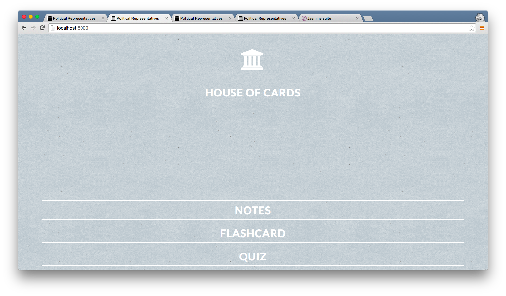
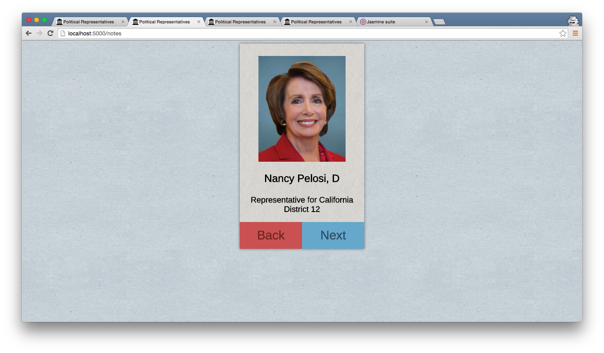
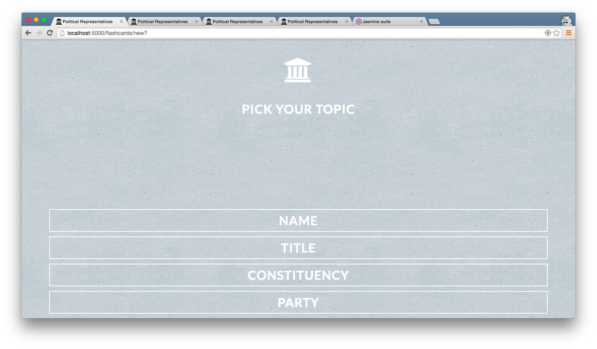
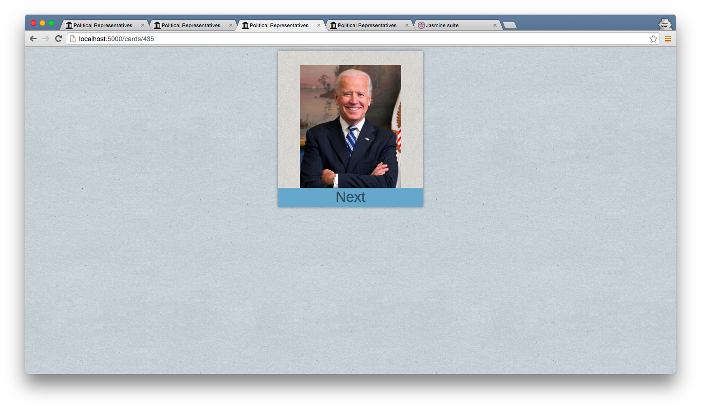
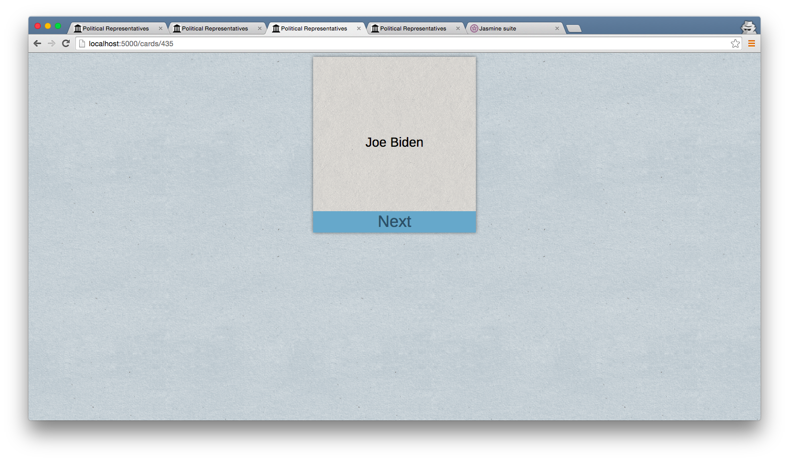
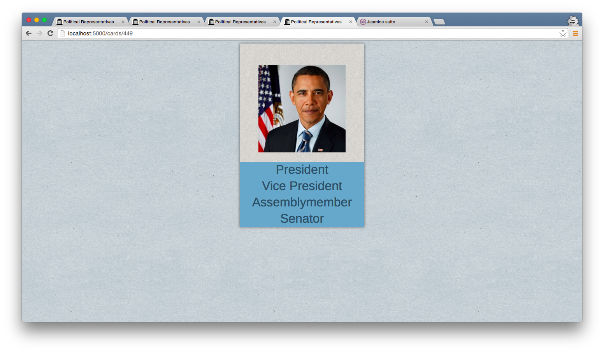
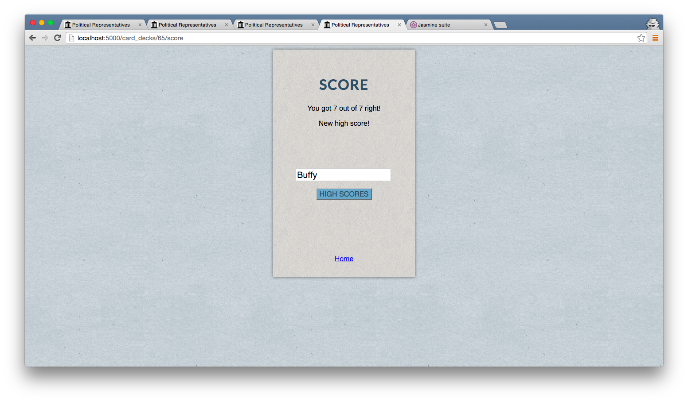
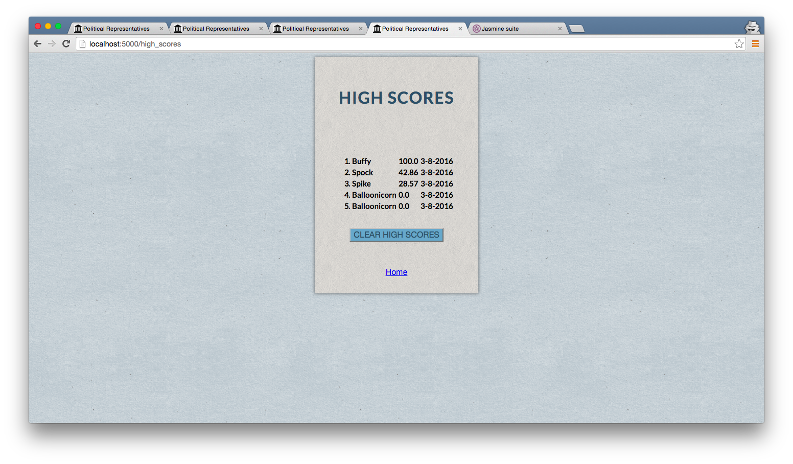
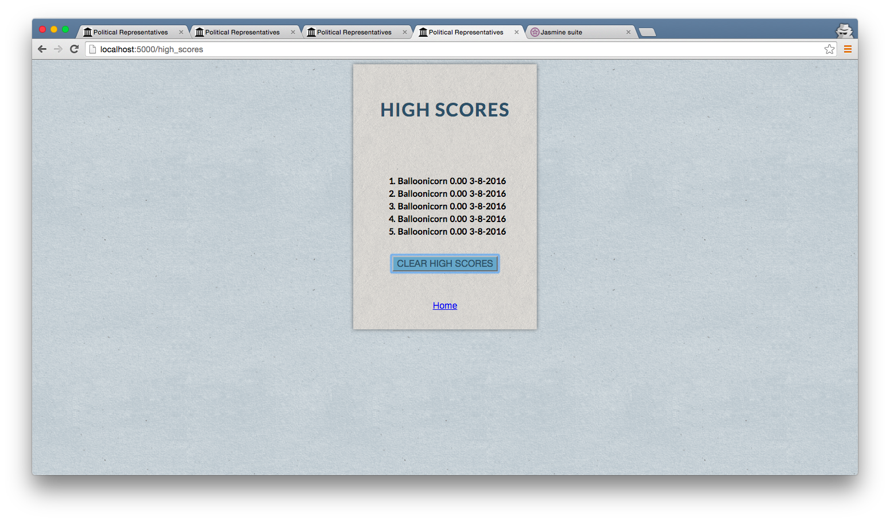

# House of Cards

### Description
Do you know who your president is? Great! Do you know who your senators and your representative are? Not bad! Do you know who your state level representatives are? Didn't think so. Enter House of Cards, an app that uses the Sunlight Foundation API and JavaScript geolocation to retrieve your personal state and federal representatives. Study notes rendered with dynamic CSS, flip through custom flashcards and quizzes based on what you want to learn, keep track of your highest scores, and clear existing scores via an AJAX request. Because the only way to make sure your voice is heard is by knowing who your voice is.

### Tech Stack
Python, Flask, SQLAlchemy, JavaScript, jQuery, AJAX, Jinja, CSS, Flexbox, Jasmine, Selenium, PostgreSQL

### Features
  - Captures user's geolocation via JavaScript
  - Creates custom "card deck" in flashcard and quiz mode, based on which field user wants to test themselves on
  - Keeps track of high scores from quiz mode, takes in user's name to update database
  - Validates user input to only have alphabetic characters to prevent SQL injection
  - Allows user to clear high scores within app via AJAX post request
  - Flask unit tests with 76% coverage
  - 6 Jasmine specs
  - Partial Selenium testing

### Installation
Running House of Cards requires an API key from the Sunlight Foundation, locally stored on a "secrets.sh" file.

```sh
$ git clone https://github.com/cachar/flashcard-app.git flashcard-app
$ cd flashcard-app
$ source env/bin/activate
$ source secrets.sh
$ pip install -r requirements.txt
$ python seed.py
$ python server.py
```
House of Cards will run on localhost:5000.

To run Jasmine testing:

```sh
$ jasmine
```
Jasmine specs will run on localhost:8888.

Landing Page


Notes View


Flashcard/Quiz Menu Screen


Flashcard Front


Flashcard Back


Quiz View


Score Result Page


High Scores Page


Cleared High Scores

